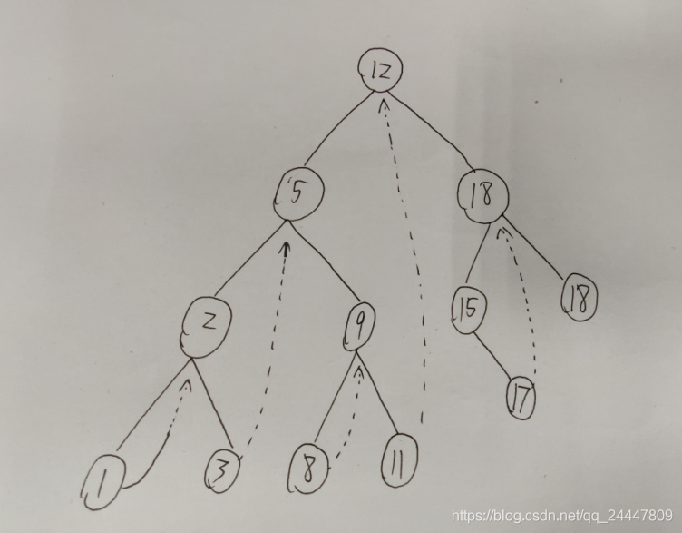

# [94.二叉树的中序遍历](https://leetcode.cn/problems/binary-tree-inorder-traversal/)

## 递归：进行中序遍历 

```c++
void travIn(TreeNode *root, vector<int> &ans) {//要传入&ans而不是ans，本题中ans一直是按着数组传递，没有用指针
  if (root == nullptr)//递归的返回条件
    return;
  travIn(root->left, ans);
  ans.push_back(root->val);//中序遍历，在中间访问节点
  travIn(root->right, ans);
}

vector<int> inorderTraversal(TreeNode *root) {
  vector<int> ans;
  travIn(root, ans);
  return ans;
}
```

## 迭代

借助一个栈来进行中序遍历

```c++
class Solution {
public:
    vector<int> inorderTraversal(TreeNode* root) {
        // 栈 先进后出
        // 前序遍历，出栈顺序：根左右; 入栈顺序：右左根
        // 中序遍历，出栈顺序：左根右; 入栈顺序：右根左
        // 后序遍历，出栈顺序：左右根; 入栈顺序：根右左
        vector<int> res;
        stack<TreeNode*> stk;
        // root为空且stack为空，遍历结束
        while (root != nullptr || !stk.empty()) {
           //先根后左入栈
            while (root != nullptr) {
                stk.push(root);
                root = root->left;
            }
            // 此时root==null，说明上一步的root没有左子树
            // 1. 执行左出栈。因为此时root==null，导致root.right一定为null
            // 2. 执行下一次外层while代码块，根出栈。此时root.right可能存在
            // 3a. 若root.right存在，右入栈，再出栈
            // 3b. 若root.right不存在，重复步骤2
            root = stk.top();
            stk.pop();
            res.push_back(root->val);
            root = root->right;
        }
        return res;
    }
};
```

## Morris中序遍历

```c++
class Solution {
public:
    vector<int> inorderTraversal(TreeNode* root) {
        vector<int> res;
        TreeNode *predecessor = nullptr;

        while (root != nullptr) {
            if (root->left != nullptr) {
                // predecessor 节点就是当前 root 节点向左走一步，然后一直向右走至无法走为止
                //也是就是中序遍历顺序中，当前root的前一个节点
                predecessor = root->left;
                while (predecessor->right != nullptr && predecessor->right != root) {
                    predecessor = predecessor->right;
                }
                
                // 让 predecessor 的右指针指向 root，继续遍历左子树
                if (predecessor->right == nullptr) {
                    predecessor->right = root;
                    root = root->left;
                }
                // 说明左子树已经访问完了，我们需要断开链接
                else {
                    res.push_back(root->val);
                    predecessor->right = nullptr;
                    root = root->right;
                }
            }
            // 如果没有左孩子，则直接访问右孩子
            else {
                res.push_back(root->val);
                root = root->right;
            }
        }
        return res;
    }
};
```

Morris 遍历在遍历的过程中，通过利用叶子节点空的right指针，指向中序遍历的后继节点，从而避免了对 stack 的依赖。

